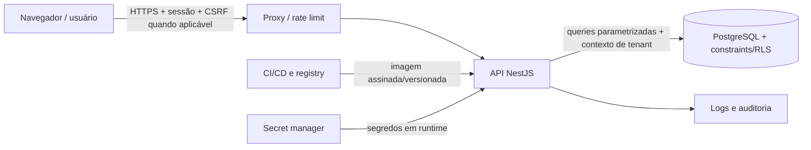

# Threat model — SaaS multi-tenant de personas

Data da revisão: 2026-08-15  
Método: STRIDE, com priorização por impacto e explorabilidade  
Revisar após mudanças de autenticação, autorização, modelo de dados, integrações ou
topologia de deploy.

## 1. Escopo e premissas

O sistema permite que Super Admins criem clientes, identidades globais sejam
vinculadas independentemente a N clientes e os administradores desses clientes
gerenciem workspaces, projetos, usuários e permissões funcionais. Personas e
questionários existem uma vez no cliente, podem ser associados por referência a N
workspaces do mesmo cliente e mantêm snapshots históricos quando usados em projetos.

Premissas a validar durante a implementação:

- frontend SPA em React acessa uma API NestJS por HTTPS;
- API é o único componente com acesso ao PostgreSQL;
- autenticação é própria ou por IdP confiável;
- jobs, cache, e-mail, armazenamento e provedor de IA ainda não fazem parte do
  escopo inicial; quando adicionados exigem nova análise.

### Ativos críticos

1. Isolamento de dados entre tenants.
2. Credenciais, sessões e fatores de autenticação.
3. Vínculos por cliente/workspace, herança, overrides, negações e autoridade global.
4. Personas, questionários, snapshots e possíveis dados pessoais.
5. Integridade dos registros de auditoria.
6. Disponibilidade da API e do PostgreSQL.
7. Segredos de infraestrutura, backups e artefatos de build.

### Atores

- usuário anônimo/atacante externo;
- membro de workspace autenticado e possivelmente vinculado a múltiplos clientes;
- Client Admin honesto ou malicioso;
- Super Admin comprometido ou malicioso;
- dependência/serviço externo comprometido;
- operador com acesso a infraestrutura/banco;
- automação ou job com contexto de tenant incorreto.

## 2. Fluxo de dados e fronteiras

Fronteiras de confiança: Internet→proxy, proxy→API, API→banco, runtime→secret
manager, CI→registry/runtime e operadores→infraestrutura.

## 3. Casos de abuso prioritários

| ID | Cenário | Impacto | Prioridade | Controles/testes principais |
|---|---|---|---|---|
| AB-01 | Client Admin A troca um ID e lê/edita/exclui projeto B | Vazamento/alteração cross-tenant | P0 | tenant da sessão; query escopada; FK/RLS; TEN-001..012 |
| AB-02 | Body envia `tenantId`, `role=SUPER_ADMIN` ou permissões ocultas | Elevação de privilégio | P0 | allowlist DTO; campos imutáveis; AUTZ-006/007 |
| AB-03 | Usuário do tenant A é movido para projeto do tenant B | Vínculo cross-tenant persistente | P0 | FK composta + transação; TEN-013..016 |
| AB-04 | Cache/listagem/exportação retorna dados de outro tenant | Vazamento em massa | P0 | cache key com tenant; filtros; TEN-005/009/017 |
| AB-05 | Sessão de admin é roubada ou refresh token reutilizado | Tomada de conta | P0 | HttpOnly/MFA/rotação/revogação; AUTH-008..014 |
| AB-06 | Atacante enumera e força convites/login/reset | Tomada de conta/abuso | P1 | respostas uniformes, token hash+TTL, rate limit |
| AB-07 | Injection por filtros, nomes ou conteúdo de persona | Compromisso DB/browser | P0 | schemas, parâmetros, CSP; INP-001..008 |
| AB-08 | Reuso de conexão mantém contexto RLS do tenant anterior | Vazamento intermitente | P0 | `SET LOCAL` em transação; testes concorrentes TEN-018 |
| AB-09 | Log/erro expõe token, PII, SQL ou stack | Vazamento e movimento lateral | P1 | redaction e erro padrão; OBS-001..006 |
| AB-10 | Container/dependência comprometida acessa DB/segredos | Compromisso sistêmico | P0 | least privilege, scans, rede, runtime hardening |
| AB-11 | Super Admin abusa do acesso global sem detecção | Vazamento global | P0 | MFA, reauth, auditoria imutável, alertas e dual control futuro |
| AB-12 | Bulk/export/job omite escopo do tenant | Vazamento silencioso | P0 | serviço tenant-aware e teste por superfície |
| AB-13 | Override de projeto é ignorado ou `ALLOW` herdado vence `DENY` explícito | Elevação de privilégio | P0 | resolver único deny-first; testes por feature/nível/escopo |
| AB-14 | Corrida remove os dois últimos administradores do cliente/workspace | Escopo órfão e indisponível | P1 | lock/isolamento serializável; teste concorrente |
| AB-15 | Ativo é associado a workspace de outro cliente ou excluído em uso | Vazamento/perda histórica | P0 | FK composta; bloqueio por uso ativo; snapshot imutável |
| AB-16 | Usuário troca o tenant selecionado e reutiliza papel de outro vínculo | BOLA/BFLA cross-tenant | P0 | contexto por rota + membership no DB por requisição |

## 4. STRIDE

| Categoria | Ameaça | Superfície | Mitigação obrigatória | Evidência esperada |
|---|---|---|---|---|
| Spoofing | Credential stuffing e brute force | login/reset/convite | MFA admin, rate limit por conta+IP+fluxo, mensagens uniformes | testes de limite e alertas |
| Spoofing | JWT forjado, expirado ou algoritmo confuso | guard de autenticação | allowlist de algoritmo, `iss/aud/exp/nbf`, rotação de chaves | AUTH-001..007 |
| Spoofing | Roubo/reuso de sessão | browser/refresh | cookie HttpOnly/Secure, rotação e revogação por família | AUTH-008..014 |
| Tampering | Mass assignment de tenant/role/permissão | JSON DTO | schema estrito, allowlist de propriedades, campos derivados | AUTZ-006/007 |
| Tampering | Troca cross-tenant de vínculos | membership/move | FKs compostas, transação e checagem tenant | TEN-013..016 |
| Tampering | SQL/command injection | busca/filtro/export | queries parametrizadas e allowlists | INP-001..005 |
| Tampering | Alteração de logs/auditoria | storage de logs | append-only, acesso restrito e envio externo | OBS-004/005 |
| Repudiation | Admin nega mudança sensível | administração | evento com ator, alvo, requestId, resultado e UTC | auditoria verificada |
| Repudiation | Ações compartilhando conta | contas admin | identidades individuais; proibir conta compartilhada; MFA | revisão de contas |
| Information disclosure | IDOR/BOLA por ID de outro tenant | todos os recursos | tenant da sessão + query/constraint/RLS | TEN-001..018 |
| Information disclosure | Resposta/cache serializa campos internos | DTO/cache | DTO de saída, cache particionado e negative tests | DATA-001..006 |
| Information disclosure | Stack/token/PII em erro ou log | logger/APM | redaction e erros estáveis | OBS-001..006 |
| Denial of service | Body, paginação, filtro ou batch ilimitado | API | limites de tamanho/tempo/itens, rate limit, timeout | DOS-001..007 |
| Denial of service | Pool/DB exaurido | API/DB | limites, circuit breaker onde aplicável, índices e observabilidade | teste de carga |
| Elevation of privilege | Client Admin chama endpoint global | rotas/guards | guard default-deny, serviços separados, reauth | AUTZ-001..005 |
| Elevation of privilege | Permissão antiga permanece em cache/token | sessão/cache | versionamento/invalidação e sessão curta | AUTZ-008..011 |
| Elevation of privilege | DB role contorna RLS | PostgreSQL | app role sem owner/superuser/BYPASSRLS; FORCE RLS | inspeção de grants |

## 5. OWASP ASVS 5.0.0 — checklist de baseline L2

O checklist abaixo é um índice operacional, não substitui a planilha oficial do
ASVS. Antes do go-live, importar a versão CSV oficial, registrar cada requisito L2
como `Pass`, `Fail`, `N/A` justificado ou `Not tested`, e anexar evidência.

| Área | Verificação do projeto | Estado inicial |
|---|---|---|
| Encoding e sanitização | output contextual; sem sinks inseguros; CSP | Não testado |
| Validação e business logic | schemas server-side, allowlists, invariantes tenant | Não testado |
| Aplicação web frontend | CSRF, clickjacking, CORS, headers, storage | Não testado |
| API e serviços web | autenticação uniforme, BOLA/BFLA, limites, DTOs | Não testado |
| Arquivos e recursos | paths/URLs permitidos, tipo/tamanho, storage privado | N/A até existir upload |
| Autenticação | senha, MFA admin, anti-enumeração, recovery | Não testado |
| Gerenciamento de sessão | cookie/token, rotação, revogação, timeout | Não testado |
| Autorização | default-deny, tenant scope, objeto/propriedade/função | Não testado |
| Tokens auto-contidos | validação JWT completa e gestão de chaves | N/A se não usar JWT |
| OAuth/OIDC | PKCE/state/nonce/redirect allowlist | N/A até integrar IdP |
| Criptografia | TLS, algoritmos atuais, gestão/rotação de chaves | Não testado |
| Comunicação segura | HTTPS/HSTS e TLS interno conforme topologia | Não testado |
| Configuração | produção hardened, debug/docs off, menor privilégio | Não testado |
| Dados | minimização, retenção, backup, redaction, descarte | Não testado |
| Secure coding/arquitetura | threat model, isolamento, revisão e gates | Em andamento |
| Logs e erros | auditoria, detecção, resposta segura e sem segredos | Não testado |
| WebRTC | verificar se introduzido | N/A |
| WebSocket | autenticação por conexão/mensagem e tenant scope | N/A até existir |
| GraphQL | depth/cost/introspection/auth por resolver | N/A até existir |
| Serviços de configuração | secret manager, rotação e acesso mínimo | Não testado |
| Segurança da cadeia | lockfile, SAST/SCA/SBOM/imagem/assinatura | Não testado |

## 6. OWASP API Security Top 10 2023 — cobertura

| Risco | Aplicação no produto | Teste/controle |
|---|---|---|
| API1 BOLA | IDs de tenant, projeto, usuário, convite, persona e pesquisa | matriz IDOR por verbo/superfície; query tenant-scoped |
| API2 Broken Authentication | login, reset, convite, refresh, MFA | AUTH-*; rate limit e revogação |
| API3 Broken Object Property Level Authorization | mass assignment e campos sensíveis na resposta | schemas estritos; DATA-* / AUTZ-* |
| API4 Unrestricted Resource Consumption | paginação, batch, busca, geração/export | limites; DOS-* e carga |
| API5 Broken Function Level Authorization | endpoints globais/client/admin | matriz papel × rota; default-deny |
| API6 Sensitive Business Flows | criação de tenants/admins, convites, export e geração futura | reauth, quotas, auditoria e proteção contra automação |
| API7 SSRF | URL de avatar/webhook/import ou provedor futuro | deny-by-default, allowlist, egress control; INP-008 |
| API8 Security Misconfiguration | Docker, CORS, headers, Swagger, erros | CONFIG-* e scan de imagem |
| API9 Improper Inventory Management | rotas antigas, versões e hosts de staging | OpenAPI/inventory; remover endpoints órfãos |
| API10 Unsafe Consumption of APIs | e-mail, IA e demais provedores futuros | timeout, TLS, validação de resposta, limites e confiança mínima |

## 7. Riscos residuais e decisões pendentes

| Decisão | Risco se adiada | Owner sugerido |
|---|---|---|
| Sessão por cookie ou bearer | armazenamento/CSRF e testes ficam ambíguos | Backend + Security |
| MFA e recuperação | takeover de contas administrativas | Produto + Security |
| Modelo de identidade/e-mail entre tenants | duplicidade, convite e enumeração inconsistentes | Arquitetura |
| Granularidade das permissões | BFLA e elevação por regra implícita | Produto + Backend |
| Soft delete/retenção/LGPD | dados órfãos e restauração indevida | Produto + Jurídico |
| RLS e modelo de acesso global | defesa no banco pode ser incompleta | Backend + DBA |
| Provedores de IA/e-mail/storage | novos fluxos de PII, SSRF e supply chain | Arquitetura + Security |

## 8. Critério de aceite do threat model

- Cada P0 possui controle preventivo, teste automatizado e owner.
- Nenhum P0/P1 permanece “aceito” sem justificativa, validade e mitigação.
- DFD corresponde ao deploy real e inclui jobs/filas/integrações adicionadas.
- Evidências dos testes críticos estão anexadas ao release.
- Security review é repetida antes de habilitar funções de personas/pesquisas em
  produção.
